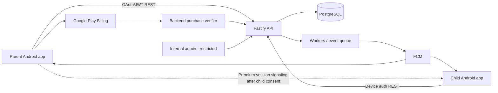

# Architecture Diagram

```mermaid
flowchart LR
  PA[Parent Android app] -->|OAuth/JWT REST| API[Fastify API]
  CA[Child Android app] -->|Device auth REST| API
  API --> DB[(PostgreSQL)]
  API --> Q[Workers / event queue]
  Q --> FCM[FCM]
  FCM --> PA
  FCM --> CA
  PA --> BILL[Google Play Billing]
  BILL --> VERIFY[Backend purchase verifier]
  VERIFY --> API
  ADMIN[Internal admin - restricted] --> API
  PA -.->|Premium session signaling after child consent| CA
```

Live media transport is a separate, gated design decision; dotted arrow is conceptual, not an authorization bypass.
