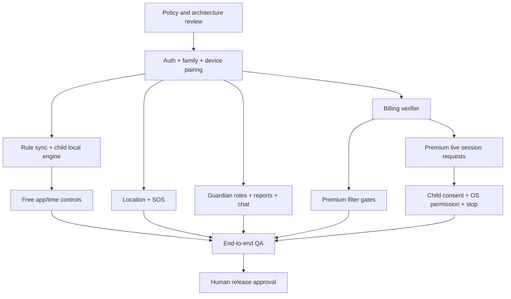

# Dependency Map

```mermaid
flowchart TD
 A[Policy and architecture review] --> B[Auth + family + device pairing]
 B --> C[Rule sync + child local engine]
 C --> D[Free app/time controls]
 B --> E[Location + SOS]
 B --> F[Guardian roles + reports + chat]
 B --> G[Billing verifier]
 G --> H[Premium filter gates]
 G --> I[Premium live session requests]
 I --> J[Child consent + OS permission + stop]
 D --> K[End-to-end QA]
 E --> K
 F --> K
 H --> K
 J --> K
 K --> L[Human release approval]
```
